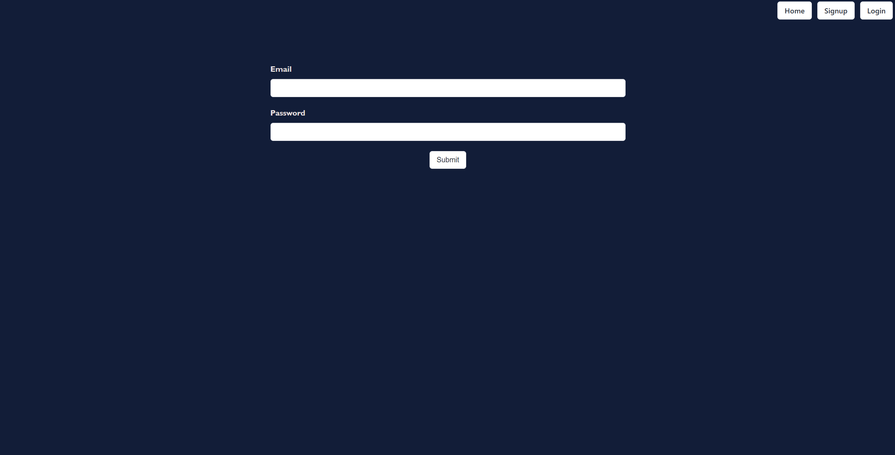
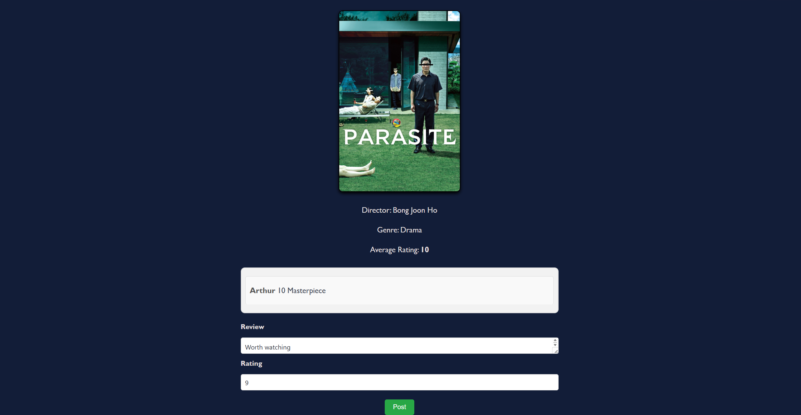
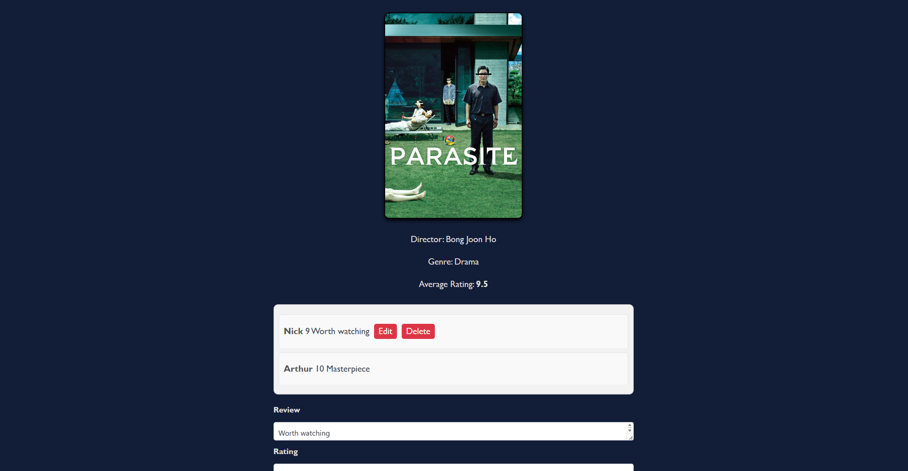

# Movie Review App

Movie Review App is a CRUD application where users are able to leave reviews and ratings for movies as well as see how other users rated and reviewed each movie. The average user rating is displayed on the landing page under the movie poster. When using this app, Users will be able to click on the 'Review' button to be redirected to a different page where they can post, update and delete their rating and review.

[Click here to use this app](https://movie-review-fe.netlify.app/)

## Technologies Used

- **Backend**: Django, Django REST Framework

- **Frontend**: React

- **Styling**: Bulma

- **Database**: PostgreSQL

## Demo

Landing page


Sign-up page


Login page



Review page





## Relevant Code

## Backend

**Auth Views**

```python

from rest_framework.views import APIView
from rest_framework.response import Response
from rest_framework import status
from rest_framework.exceptions import PermissionDenied
from datetime import datetime, timedelta # these create timestamps in different formats
from django.contrib.auth import get_user_model
from django.conf import settings
from . serializers import UserSerializer

import jwt

User = get_user_model()

class RegisterView(APIView):

    def post(self, request):
        user_to_create = UserSerializer(data=request.data)
        print('USER CREATE', user_to_create)
        if user_to_create.is_valid():
            user_to_create.save()
            return Response({'message': 'User created successfully'}, status=status.HTTP_201_CREATED)
        return Response(user_to_create.errors, status=status.HTTP_422_UNPROCESSABLE_ENTITY)

class LoginView(APIView):

    def post(self, request):
        # get the data you need out of the request object (email and password)
        email = request.data.get('email')
        password = request.data.get('password')

        try:
            user_to_login = User.objects.get(email=email) # query the database for the user associated with the provided email
        except User.DoesNotExist:
            raise PermissionDenied(detail="invalid Credentials")
        
        if not user_to_login.check_password(password): # if the provided password is incorrect
            raise PermissionDenied(detail="Invalid Credentials")
        
        # datetime is the python equivalent of the new Date(). In this case, we combine it with time delta to create a time/date 7 days in the future
        # This 'dt' will be the expiry time of the issued token
        dt = datetime.now() + timedelta(days=7)
        token = jwt.encode(
            {'sub': user_to_login.id, 'exp': int(dt.strftime('%s'))},
            settings.SECRET_KEY,
            algorithm='HS256'
        )

        return Response({'token': token, 'message': f'Welcome back {user_to_login.first_name}'})

        return

```

**Directors Views**

```python
from rest_framework.views import APIView
from rest_framework.response import Response
from rest_framework import status
from rest_framework.permissions import IsAuthenticatedOrReadOnly
from .models import Director
from .serializers.common import DirectorSerializer
from .serializers.populated import PopulatedDirectorSerializer

class DirectorListView(APIView):
  permission_classes = (IsAuthenticatedOrReadOnly, )

  def get(self, _request):
    directors = director.objects.all()
    serialized_directors = PopulatedDirectorSerializer(directors, many=True)
    return Response(serialized_directors.data, status=status.HTTP_200_OK)
  
  def post(self, request):
    director_to_add = DirectorSerializer(data=request.data)
    if director_to_add.is_valid():
      director_to_add.save()
      return Response(director_to_add.data, status=status.HTTP_201_CREATED)

    return Response(director_to_add.errors, status=status.HTTP_422_UNPROCESSABLE_ENTITY)

class DirectorDetailView(APIView):
  permission_classes = (IsAuthenticatedOrReadOnly, )

  def get_director(self, pk):
    try:
      return Director.objects.get(pk=pk)
    except Director.DoesNotExist:
      raise NotFound(detail="Can't find that director") 
      
  def get(self, _request, pk):
    try:
      director = Director.objects.get(pk=pk)
      serialized_director = PopulatedDirectorSerializer(director)
      return Response(serialized_director.data, status=status.HTTP_200_OK)
    except Director.DoesNotExist:
      raise NotFound(detail="Can't find that director")

  def put(self, request, pk):
      director_to_update = self.get_director(pk=pk)
      updated_director = DirectorSerializer(director_to_update, data=request.data)

      if updated_director.is_valid():
          updated_director.save()
          return Response(updated_director.data, status=status.HTTP_202_ACCEPTED)
      return Response(updated_director.errors, status=status.HTTP_422_UNPROCESSABLE_ENTITY)
    
  def delete(self, _request, pk):
      director_to_delete = self.get_director(pk=pk)
      director_to_delete.delete()
      return Response(status=status.HTTP_204_NO_CONTENT)
```

**Genres Views**

```python
from rest_framework.views import APIView
from rest_framework.response import Response
from rest_framework import status
from rest_framework.permissions import IsAuthenticatedOrReadOnly
from .models import Genre
from .serializers.common import GenreSerializer
from .serializers.populated import PopulatedGenreSerializer

class GenreListView(APIView):
  permission_classes = (IsAuthenticatedOrReadOnly, )

  def get(self, _request):
    genres = Genre.objects.all()
    serialized_genres = PopulatedGenreSerializer(genres, many=True)
    return Response(serialized_genres.data, status=status.HTTP_200_OK)
  
  def post(self, request):
    genre_to_add = GenreSerializer(data=request.data)
    if genre_to_add.is_valid():
      genre_to_add.save()
      return Response(genre_to_add.data, status=status.HTTP_201_CREATED)

    return Response(genre_to_add.errors, status=status.HTTP_422_UNPROCESSABLE_ENTITY)

class GenreDetailView(APIView):
  permission_classes = (IsAuthenticatedOrReadOnly, )

  def get_genre(self, pk):
    try:
      return Genre.objects.get(pk=pk)
    except Genre.DoesNotExist:
      raise NotFound(detail="Can't find that movie") 
      
  def get(self, _request, pk):
    try:
      genre = Genre.objects.get(pk=pk)
      serialized_genre = PopulatedGenreSerializer(genre)
      return Response(serialized_genre.data, status=status.HTTP_200_OK)
    except Genre.DoesNotExist:
      raise NotFound(detail="Can't find that genre")

  def put(self, request, pk):
      genre_to_update = self.get_genre(pk=pk)
      updated_genre = GenreSerializer(genre_to_update, data=request.data)

      if updated_genre.is_valid():
          updated_genre.save()
          return Response(updated_genre.data, status=status.HTTP_202_ACCEPTED)
      return Response(updated_genre.errors, status=status.HTTP_422_UNPROCESSABLE_ENTITY)
    
  def delete(self, _request, pk):
      genre_to_delete = self.get_genre(pk=pk)
      genre_to_delete.delete()
      return Response(status=status.HTTP_204_NO_CONTENT)
```

**Movies Views**

```python
from rest_framework.views import APIView
from rest_framework.response import Response 
from rest_framework import status 
from rest_framework.permissions import IsAuthenticatedOrReadOnly
from .models import Movie
from .serializers.common import MovieSerializer
from .serializers.populated import PopulatedMovieSerializer

class MovieListView(APIView):

  def get(self, _request):
    movies = Movie.objects.all()
    serialized_movies = PopulatedMovieSerializer(movies, many=True)
    return Response(serialized_movies.data, status=status.HTTP_200_OK)
  
  def post(self, request):
    #if req.user.isAdmin = True
    #if req.user.username = admin
    movie_to_add = MovieSerializer(data=request.data)
    if movie_to_add.is_valid():
      movie_to_add.save()
      return Response(movie_to_add.data, status=status.HTTP_201_CREATED)

    return Response(movie_to_add.errors, status=status.HTTP_422_UNPROCESSABLE_ENTITY)

class MovieDetailView(APIView):

  def get_movie(self, pk):
    try:
      return Movie.objects.get(pk=pk)
    except Movie.DoesNotExist:
      raise NotFound(detail="Can't find that movie") 
      
  def get(self, _request, pk):
    try:
      movie = Movie.objects.get(pk=pk)
      serialized_movie = PopulatedMovieSerializer(movie)
      return Response(serialized_movie.data, status=status.HTTP_200_OK)
    except Movie.DoesNotExist:
      raise NotFound(detail="Can't find that movie")

  def put(self, request, pk):
      movie_to_update = self.get_movie(pk=pk)
      updated_movie = MovieSerializer(movie_to_update, data=request.data)

      if updated_movie.is_valid():
          updated_movie.save()
          return Response(updated_movie.data, status=status.HTTP_202_ACCEPTED)
      return Response(updated_movie.errors, status=status.HTTP_422_UNPROCESSABLE_ENTITY)
    
  def delete(self, _request, pk):
      movie_to_delete = self.get_movie(pk=pk)
      movie_to_delete.delete()
      return Response(status=status.HTTP_204_NO_CONTENT)
```

## Frontend

**Home Component**

```javascript
import React, { useEffect, useState } from 'react';
import axios from 'axios';
import { Link, useLocation } from 'react-router-dom';
import { toast } from 'react-toastify';
import { baseUrl } from '../config';


const Home = () => {
  const [movies, setMovies] = useState([]);
  const location = useLocation();
  const [isLoggedIn, setIsLoggedIn] = useState(localStorage.getItem('token'));

  useEffect(() => {
    setIsLoggedIn(localStorage.getItem('token'));
  }, [location]);

  useEffect(() => {
    const fetchMovies = async () => {
      try {
        const response = await axios.get(`${baseUrl}/api/movies`);
        setMovies(response.data);
      } catch (err) {
        console.log('Did not fetch');
      }
    };
    fetchMovies();
  }, []);

  function handleUser() {
    toast.error('Log in to post reviews and ratings');
  }

  return (
    <>
      <h1 className="title1">Welcome to <span className="ft">Fresh Tomatoes 🍅</span></h1>
      <h2 className="title1">Rate, Review, and Discover Your Next Favorite Movie!</h2>
      <div className="container-movies">
        {movies.map((movie) => {
          const averageRating = Math.round(movie.average_rating * 10) / 10;
          const ratingEmoji = averageRating >= 5 ? '🍅' : '🦠';
          return (
            <div className="posters" key={movie.id}>
              <ul key={movie.id} className="movie-list">
                <li className="movie-item">
                  
                  <div className="review-container">
                  <p className="rating">{averageRating} {ratingEmoji}</p>
                    {isLoggedIn ? (
                      <Link to={`/movies/${movie.id}`}>
                        <div className="review"></div>
                      </Link>
                    ) : (
                      <div onClick={() => { handleUser() }} className="review"></div>
                    )}
                  </div>
                </li>
              </ul>
            </div>
          );
        })}
      </div>
    </>
  );
}

export default Home;
```

**Movies Component**

```javascript
import { useEffect, useState } from 'react';
import { useParams } from 'react-router-dom';
import axios from 'axios';
import { toast } from 'react-toastify';
import { baseUrl } from '../config';

// Helper function to parse JWT token
function parseJwt(token) {
    try {
        const base64Url = token.split('.')[1];
        const base64 = base64Url.replace(/-/g, '+').replace(/_/g, '/');
        const jsonPayload = decodeURIComponent(
            atob(base64)
                .split('')
                .map(c => '%' + ('00' + c.charCodeAt(0).toString(16)).slice(-2))
                .join('')
        );

        return JSON.parse(jsonPayload);
    } catch (error) {
        console.error('Error parsing JWT:', error);
        return null;
    }
}

const Movie = () => {
    const { movieId } = useParams();
    const [movie, setMovie] = useState(null);
    const [userId, setUserId] = useState(null);
    const [userReviewed, setUserReviewed] = useState(false);
    const [editingReviewId, setEditingReviewId] = useState(null); // Track which review is being edited
    const [formData, setFormData] = useState({
        text: '',
        ratings: '',
        movie: Number(movieId),
    });

    // Fetch movie data and check if the user has already reviewed it
    async function fetchMovieAndCheckReview() {
        try {
            const response = await axios.get(`${baseUrl}/api/movies/${movieId}`);
            const movieData = response.data;
            setMovie(movieData);

            const token = localStorage.getItem('token');
            if (token) {
                const decodedToken = parseJwt(token);
                if (decodedToken) {
                    const userId = decodedToken.sub;
                    setUserId(userId);
                    const hasReviewed = movieData.reviews.some(review => review.owner.id === userId);
                    setUserReviewed(hasReviewed);
                } else {
                    console.error('Failed to decode JWT token.');
                }
            }
        } catch (error) {
            console.error('Error fetching movie:', error);
        }
    }

    useEffect(() => {
        fetchMovieAndCheckReview();
    }, [movieId]);

    // Update form data on change
    function handleChange(e) {
        const newFormData = { ...formData };
        newFormData[e.target.name] = e.target.value;
        setFormData(newFormData);
    }

    // Handle new review submission
    async function handleSubmit(e) {
        e.preventDefault();
    
        try {
            if (formData.text === '' || formData.ratings === '') {
                toast.error('Fill in ratings and reviews to post');
                return;
            } else if (formData.text.length > 55) {
                toast.error('Reviews must be under 55 characters');
                return;
            } else if (formData.ratings > 10 || formData.ratings < 0) {
                toast.error('Ratings must be between 0 and 10');
                return;
            }
    
            // Check if the user has already reviewed the movie
            const hasReviewed = movie.reviews.some(review => review.owner.id === userId);
            if (hasReviewed) {
                toast.error('You have already reviewed this movie.');
                return;
            }
    
            // Proceed with submitting the review
            await axios.post(`${baseUrl}/api/reviews/`, formData, {
                headers: {
                    Authorization: `Bearer ${localStorage.getItem('token')}`,
                },
            });
            toast.success('Review posted!');
            fetchMovieAndCheckReview(); // Reload movie data after submit
        } catch (err) {
            toast.error(err.response.data.message || 'Error posting/reviewing');
            console.error('Error posting/reviewing:', err);
        }
    }

    // Handle review deletion
    async function handleDeleteReview(reviewId) {
        try {
            await axios.delete(`${baseUrl}/api/reviews/${reviewId}`, {
                headers: {
                    Authorization: `Bearer ${localStorage.getItem('token')}`,
                },
            });
            toast.success('Review deleted!');
            fetchMovieAndCheckReview();
        } catch (err) {
            toast.error('Error deleting review:', err);
            console.error('Error deleting review:', err);
        }
    }

    // Handle review update
    async function handleEditReview(e) {
        e.preventDefault();
    
        try {
            if (!formData.text || !formData.ratings || !formData.movie) {
                toast.error('Please fill in all fields.');
                return;
            }
    
            // Ensure 'owner' is added to formData
            formData.owner = userId; // Assuming userId is correctly set in your component
    
            const response = await axios.put(`${baseUrl}/api/reviews/${editingReviewId}`, formData, {
                headers: {
                    Authorization: `Bearer ${localStorage.getItem('token')}`,
                },
            });
    
            toast.success('Review updated!');
            fetchMovieAndCheckReview();  // Refresh the movie data after update
            setEditingReviewId(null);    // Reset editing state after successful edit
        } catch (error) {
            if (error.response) {
                console.error('Error updating review:', error.response.data);
                toast.error('Error updating review: ' + error.response.data.detail);
            } else {
                console.error('Error updating review:', error.message);
                toast.error('Error updating review: ' + error.message);
            }
        }
    }

    // Start editing a review
    const startEditingReview = (review) => {
        setFormData({
            text: review.text,
            ratings: review.ratings,
            movie: Number(movieId),
        });
        setEditingReviewId(review.id); // Set the ID of the review being edited
    };

    return (
        <div className="container">
            {movie && (
                <>
                    
                    <p className="info">Director: {movie.director.name}</p>
                    <p className="info">Genre: {movie.genre.name}</p>
                    <p className="info">Average Rating: <b>{Math.round(movie.average_rating * 10) / 10}</b></p>
                    {movie.reviews && movie.reviews.length > 0 && (
                        <div className="reviews">
                            {movie.reviews.slice(-8).reverse().map((review) => (
                                <div key={review.id}>
                                    <ul className='reviewslist'>
                                        <li className='review-item'>
                                            {review.owner.id === userId ? (
                                                <p>
                                                    <b>{review.owner.username}</b> {review.ratings} {review.text}
                                                    <button onClick={() => startEditingReview(review)}>Edit</button>
                                                    <button onClick={() => handleDeleteReview(review.id)}>Delete</button>
                                                </p>
                                            ) : (
                                                <p><b>{review.owner.username}</b> {review.ratings} {review.text}</p>
                                            )}
                                        </li>
                                    </ul>
                                </div>
                            ))}
                        </div>
                    )}
                    <form onSubmit={editingReviewId ? handleEditReview : handleSubmit}>
                        <div className="field">
                            <div className="control">
                                <label className="label">Review</label>
                                <textarea
                                    id='reviewbox'
                                    className="input"
                                    name='text'
                                    onChange={handleChange}
                                    value={formData.text}
                                />
                            </div>
                            <div className="control">
                                <label className="label">Rating</label>
                                <input
                                    id='ratingbox'
                                    className="input"
                                    type="number"
                                    name='ratings'
                                    onChange={handleChange}
                                    value={formData.ratings}
                                />
                            </div>
                        </div>
                        <button className="postReviewButton">{editingReviewId ? 'Update' : 'Post'}</button>
                    </form>
                </>
            )}
        </div>
    );
};

export default Movie;
```

## Stretch Goals

- Critics review feature

## Acknowledgments

- [Movie posters](https://www.themoviedb.org/)